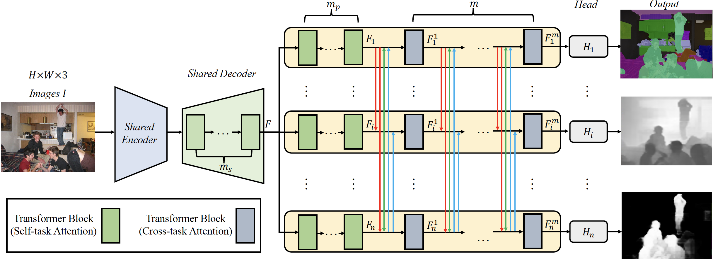

# MTFormer

This is a pytorch project for the paper **MTFormer: Multi-Task Learning via Transformer and Cross-Task Reasoning** by Xiaogang Xu, Hengshuang Zhao, Vibhav Vineet, Ser-Nam Lim, Antonio Torralba presented at **ECCV2022**.


## Introduction
In this paper, we propose a novel transformer-based architecture named MTFormer for MTL. In the framework, multiple tasks share the same transformer encoder and transformer decoder, and lightweight branches are introduced to harvest task-specific outputs, which increases the MTL performance and reduces the time-space complexity. 
Furthermore, information from different task domains can benefit each other, and we conduct cross-task reasoning. We propose a cross-task attention mechanism for further boosting the MTL results. The cross-task attention mechanism brings little parameters and computations while introducing extra performance improvements. 
Besides, we design a self-supervised cross-task contrastive learning algorithm for further boosting the MTL performance. Extensive experiments are conducted on two multi-task learning datasets, on which MTFormer achieves state-of-the-art results with limited network parameters and computations. 



[paper link]("./MTFormer.pdf")

## dataset
We utilize the datasets processed by https://github.com/SimonVandenhende/Multi-Task-Learning-PyTorch, and you can download the datasets of 
[NYUD-v2](https://drive.google.com/file/d/14EAEMXmd3zs2hIMY63UhHPSFPDAkiTzw/view)
and 
[PASCAL](https://data.vision.ee.ethz.ch/kmaninis/share/MTL/PASCAL_MT.tgz) following the corresponding instructions.

## Project Setup

First install Python 3. We advise you to install Python 3 and PyTorch with Anaconda:

```
conda create --name py36 python=3.6
source activate py36
```

Clone the repo and install the complementary requirements:
```
cd $HOME
git clone --recursive git@github.com:xiaogang00/MTFormer.git
cd MTFormer
pip install -r requirements.txt
```

This code is validated on RTX2080 with CUDA10.2.

Please modify the corresponding path in "utils/mypath.py" (db_root and seism_root), "utils/common_config.py" (pretrain_path), and "configs/env.yml" (root_dir)

## Usage

### Train
Train the MTFormer on NYUD-v2:
```
python main_CL_nyud.py --config_env configs/env.yml --config_exp configs/nyud/multi_task_MTFormer.yml
```

Train the MTFormer on PASCAL:
```
python main_CL_pascal.py --config_env configs/env.yml --config_exp configs/pascal/multi_task_MTFormer.yml
```

### Test
During the training, the evaluation will be conducted (if eval_final_10_epochs_only: True in the corresponding config, the evaluation will be made during the last 10 epochs; otherwise, the evaluation will be conducted in after every epoch)

We provide the pre-trained models for [NYUD-v2](https://drive.google.com/file/d/1b9kWyrmtl1HNzRPBeFfMFfKJe4Pvkl2m/view?usp=sharing) and [PASCAL](https://drive.google.com/file/d/1KYuK-ZAldG9021z1xHryUBYpx2xxCJRo/view?usp=sharing). Please download and put them under the dictionary of 'output/NYUD/swim_transformer2' and 'output/PASCALContext/swim_transformer2'

And then run the code which can automatically compute the results
```
python main_CL_nyud.py --config_env configs/env.yml --config_exp configs/nyud/multi_task_MTFormer.yml

python main_CL_pascal.py --config_env configs/env.yml --config_exp configs/pascal/multi_task_MTFormer.yml
```

## Citation Information

If you find the project useful, please cite:

```
@inproceedings{xu2022mtformer,
  title={MTFormer: Multi-Task Learning via Transformer and Cross-Task Reasoning},
  author={Xiaogang Xu, Hengshuang Zhao, Vibhav Vineet, Ser-Nam Lim, and Antonio Torralba},
  booktitle={ECCV},
  year={2022}
}
```


## Acknowledgments
This source code is inspired by [MTI-Net](https://github.com/SimonVandenhende/Multi-Task-Learning-PyTorch), [Swin-Transformer](https://github.com/microsoft/Swin-Transformer).

## Contributions
If you have any questions/comments/bug reports, feel free to e-mail the author Xiaogang Xu ([xiaogangxu00@gmail.com](xiaogangxu00@gmail.com)).
